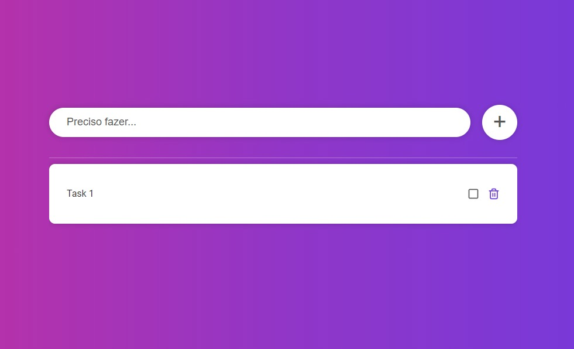
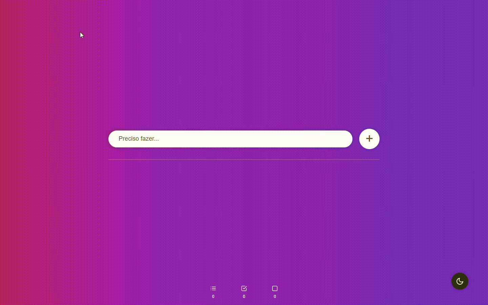

<h4 align="center">
  :ballot_box_with_check: Todo List | Recoil Test
</h4>
 

    

  :computer: <a href="#computer-tecnologias">Tecnologias</a>&nbsp;&nbsp;&nbsp;|&nbsp;&nbsp;&nbsp;
  :eye: <a href="#eye-preview">Preview</a>&nbsp;&nbsp;&nbsp;|&nbsp;&nbsp;&nbsp;
  :gem: <a href="#moon-iniciando-a-aplicação"> Iniciando a aplicação </a>

 
 

## :computer: Tecnologias
- [Reactjs](https://pt-br.reactjs.org/), [Nextjs](https://nextjs.org/)
- [Recoil](https://recoiljs.org/)
- [Styled-Components](https://styled-components.com/)

 
 

## :eye: Preview

    

 
 

## :moon: Iniciando a aplicação 

**1.** Clone o repositório para sua máquina usando o comando `git clone https://github.com/juliannevolotao/todo-list-recoil.git` no local desejado através do terminal. Em seguida acesse a pasta do projeto com o comando `cd todo-list-recoil`.

 

**2.** Execute o comando `yarn` ou `npm install` através do terminal para instalar as dependências.

 

**3.** Por fim, rode a aplicação com `yarn dev` ou `npm run dev`. Se tudo ocorrer bem abra [http://localhost:3000](http://localhost:3000) no navegador para visualizar o projeto

 
 

<h5 align="center">
  :heart: Desenvolvido por Julianne Volotão.
</h5>

 
 
